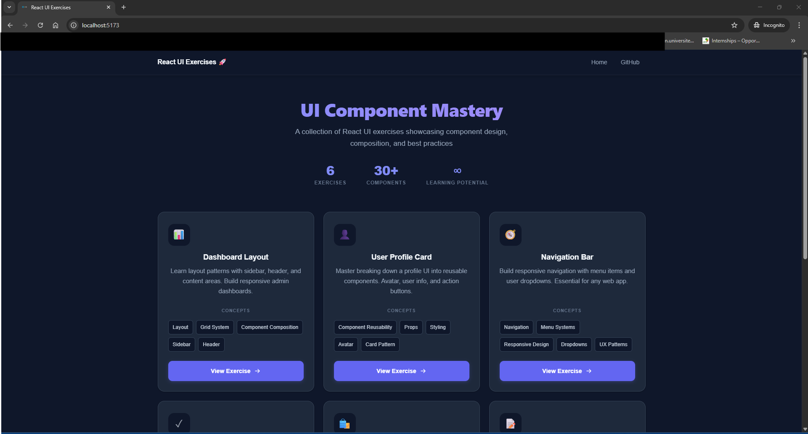
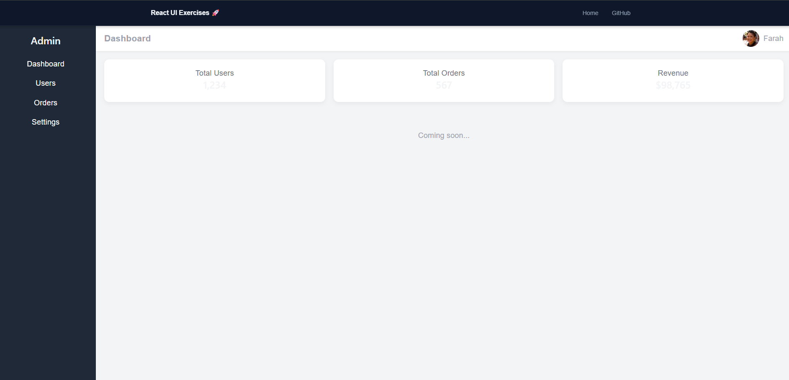
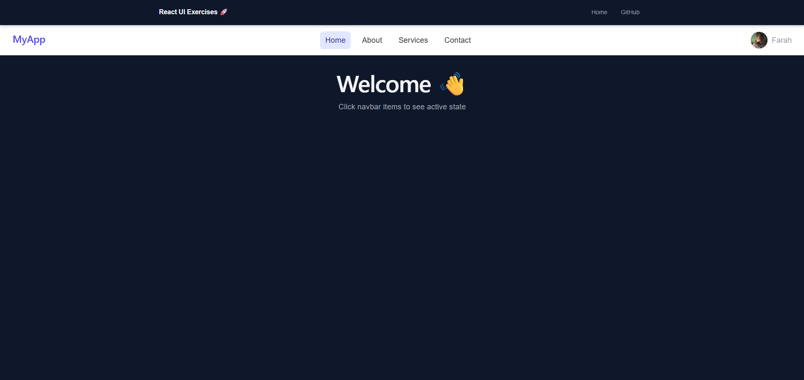

# react-mastery : 🚀 React User Dashboard

## 📌 Overview

A production-ready React dashboard that fetches and displays users with real-time search and performance optimization.

## 🧠 Features

- API integration with error handling
- Debounced search for performance
- Clean component architecture
- Routing with React Router
- Loading & empty states

## ⚙️ Tech Stack

- React (Hooks)
- TypeScript
- Vite
- React Router

## 📂 Architecture

- components/
- pages/
- services/
- hooks/

## 🚀 Getting Started

```bash
npm install
npm run dev
```

## 🌍 Live Demo

[👉 (Versel deployement link here)](https://react-mastery-neex.vercel.app/)

## 📸 Screenshots

| Home                                                   | Project Structure                                                             |
| ------------------------------------------------------ | ----------------------------------------------------------------------------- |
|  |  |

| Exercise 1                                             | Exercise 2                                             |
| ------------------------------------------------------ | ------------------------------------------------------ |
|  |  |

## 🧩 Key Concepts Demonstrated

- Lifting state up
- Derived state
- Memoization
- API error handling

## 👩‍💻 Author

Farah
